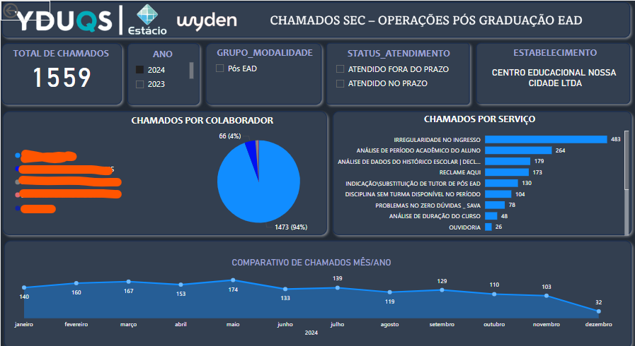

# 📊 Projeto Power BI – Análise de Dados de Chamados internos na área acadêmica de cursos de Pós-Graduação EAD.

Este projeto tem como objetivo criar dashboards interativos e visuais para análise de dados de vendas, utilizando o Power BI. Foi desenvolvido para acompanhar indicadores de performance, como volume de vendas, receita total e segmentação de clientes.  

---

## 📌 **Objetivos do Projeto**
- Analisar a quantidade de chamados abertos, fechados, em andamento.  
- Identificar tendências dos tipos de chamados, analisar quais estão mais em alta e propor melhorias internas.
- Métricas de quantidade de chamados por mês separando por determinados colaboradores
- Melhorar a tomada de decisão com visualizações claras e objetivas.  

---

## 🛠️ **Ferramentas Utilizadas**
- **Power BI Desktop** – Criação dos dashboards.  
- **GitHub Desktop** – Versionamento do projeto.  
- **Excel & CSV** – Bases de dados de chamados utilizadas.  
- **DAX (Data Analysis Expressions)** – Criação de medidas e cálculos.  

---

## 📈 **Desenvolvimento do Projeto**
O projeto foi desenvolvido em fases para garantir uma abordagem estruturada:  

1. **Planejamento e Definição de Métricas:**  
   - Definição de KPIs como Receita Total, Ticket Médio e Vendas por Região.  
2. **Coleta e Tratamento de Dados:**  
   - Importação de bases CSV e planilhas Excel.  
   - Limpeza e padronização usando o Power Query.  
3. **Modelagem de Dados:**    
   - Criação de colunas calculadas e medidas em DAX.  
4. **Criação dos Dashboards:**  
   - Desenvolvimento de gráficos interativos (barras, pizza e linha).  
   - Utilização de segmentações e filtros dinâmicos.  
5. **Publicação e Versionamento:**  
   - Versionamento no GitHub para controle de alterações e colaboração.  

